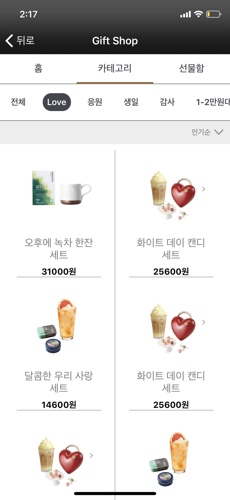

# Starbucks-Clone
> 패스트캠퍼스에서 진행한 2주 프로젝트, 현재 서버와 함께 리팩토링중

## Description

- 커머스 앱의 성격을 띄면서 규모가 크지 않은 앱을 클론하며 UI/UX 파악
- 기획하는 시간을 없애는 대신, 코드의 효율성과 기능 구현에 집중

## Implementation

- `Timer()`를 사용하여 배너가 자동으로 스크롤 되도록 구현

  <p>
    
  </p>

- 메뉴바 버튼을 눌렀을 때 컨텐츠 화면 자동 스크롤 <-> 컨텐츠 화면 스크롤 했을 때 메뉴바 버튼 눌린 효과
  
  - 델리게이트 사용하여, 메뉴바 버튼과 컨텐츠뷰 contentoffset 연결
  
    <p>
      
    </p>
  
- 홈 화면 태그 버튼 눌렀을 때 해당하는 카테고리 화면으로 넘어감
  - `sendAction` 을 사용하여 홈 화면 태그 버튼을 눌렀을 때 카테고리 내 태그 버튼이 눌러지도록 구현
  
    <p>
      
    </p>
  
## TroubleShooting 
- view의 depth가 깊어 view간의 연결 또는 VC에게 액션 전달의 어려움
  - Notification 사용
  - 버튼의 `sendAction` 메서드 사용
  - 자신의 ViewController를 찾는 재귀함수를 사용하여 VC 찾기
    ```swift
    extension UIView {
      var parentNaviController: UINavigationController? {
        var responder: UIResponder? = self
        while let nextResponder = responder?.next {
          responder = nextResponder
          if let navi = nextResponder as? UINavigationController {
            return navi
          }
          return nil
        }
      }
    }
    ```

## Screen

- Home

  <p>
    
    
  </p>

  

- Theme

  <p>
    
  </p>

- Category

  <p>
    
  </p>

- Detail

  <p>
    
    
  </p>


## Using Skills & Code Rule

- Swift
- Class 안에 순서
  1. Property
  2. LifeCycle
  3. set func (`setUI()`, `setLayout()`)
- UI Naming: `"name"Label`,` "name"Button`
- Button Function Name: `didTap"name"Button()`
- Setting Fuction Name: `setLayout()`
